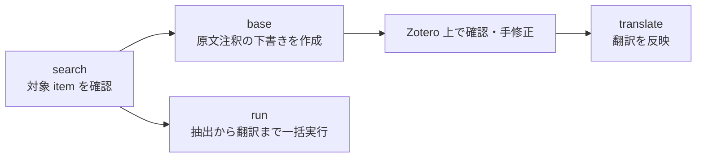

# Zotero Annotator

<p align="center">
  
  
  
  <a href="LICENSE"></a>
  <a href="https://www.python.org/downloads/"></a>
  <a href="https://docs.astral.sh/uv/"></a>
    
</p>

<p align="center">
  <strong>Zotero の PDF から、段落ごとの原文注釈と翻訳付きノートを自動生成する CLI。</strong><br>
  研究メモ作成を、PDF と翻訳ツールの往復なしで進められます。
</p>

## できること

- **Zotero 上で完結**: 原文段落と翻訳を同じ注釈に残せます。
- **運用を選べる**: `run` で一括処理、`base -> translate` で確認を挟む運用を切り替えられます。
- **再実行しやすい**: タグ運用で item と注釈の進捗を追えます。

## ワークフロー

推奨ルートは `base -> translate` です。`base` が作る下書きを Zotero 上で確認してから翻訳を反映できます。



## クイックスタート

### 前提

- Python `3.11+`
- `uv`
- Zotero API の認証情報
- 利用する翻訳プロバイダーの認証情報、または起動済みのローカル LLM

### 1. セットアップ

```bash
uv venv
UV_LINK_MODE=copy uv sync --no-editable
source .venv/bin/activate
cp .env.example .env
```

`.env` の各項目は [設定](docs/configuration.md) を参照してください。初回セットアップ全体は [セットアップ](docs/setup.md)、`TRANSLATOR_PROVIDER=local_llm` を使う場合は [ローカル LLM セットアップ](docs/local-llm.md) を参照してください。

### 2. 最初の 1 件を試す
- 処理したい Zotero item　（論文） に タグ：`to-translate` を付ける
```bash
zotero-annotator search
zotero-annotator base --item-key ABCD1234
```

## ドキュメント

| やりたいこと | 読むページ |
| --- | --- |
| 初回セットアップを進める | [セットアップ](docs/setup.md) |
| `.env` の意味を確認する | [設定](docs/configuration.md) |
| CLI のオプションを調べる | [CLI リファレンス](docs/cli.md) |
| 通常運用の流れを確認する | [運用フロー](docs/workflows.md) |
| ローカル LLM を使う | [ローカル LLM セットアップ](docs/local-llm.md) |
| 開発に参加する | [開発ガイド](docs/development.md) |

## ライセンス

本リポジトリのソースコード自体は [MIT License](LICENSE) で提供します。

<details>
  <summary>Third-party licensing note</summary>

- 依存ライブラリにはそれぞれ別のライセンスが適用されます。
- 特に `pymupdf` は公式情報上、AGPL または Artifex の商用ライセンスで提供されています。
- 本リポジトリのコードを MIT で公開することと、依存ライブラリを含む形でアプリやサービスを配布・提供できるかは別問題です。
- 配布または公開前に、各依存ライブラリのライセンス条件、著作権表示、NOTICE 要件を確認してください。
- 必要に応じて法務確認または商用ライセンスの検討を行ってください。

</details>
